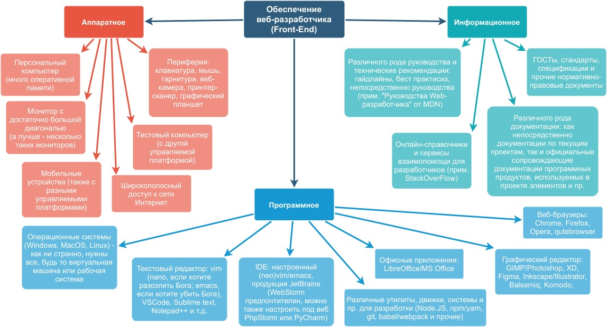

# Задание 1.11

Изучить и проанализировать аппаратное, программное и информационное обеспечение автоматизированного рабочего места специалиста в конкретной предметной области (по выбору студента). Оценка рабочего места специалиста.

Интеллект-карта (опубликовать в электронном портфолио, QR-код в отчете)

## Отчёт по заданию

Также доступен в [формате PDF](1.11.pdf) и [XML (draw.io)](1.11.xml).

