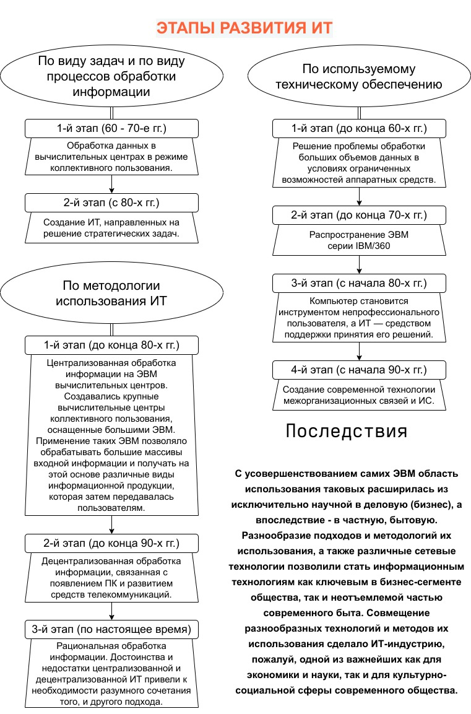

# Задание 1.2

Выделить важные этапы в истории развития информатики и их социальные последствия

Представить в виде схемы (интеллект-карта)
(опубликовать в электронном портфолио, QR-код в отчете)

## Отчёт по заданию

Также доступен в [формате PDF](1.2.pdf) и [XML (draw.io)](1.2.xml).

