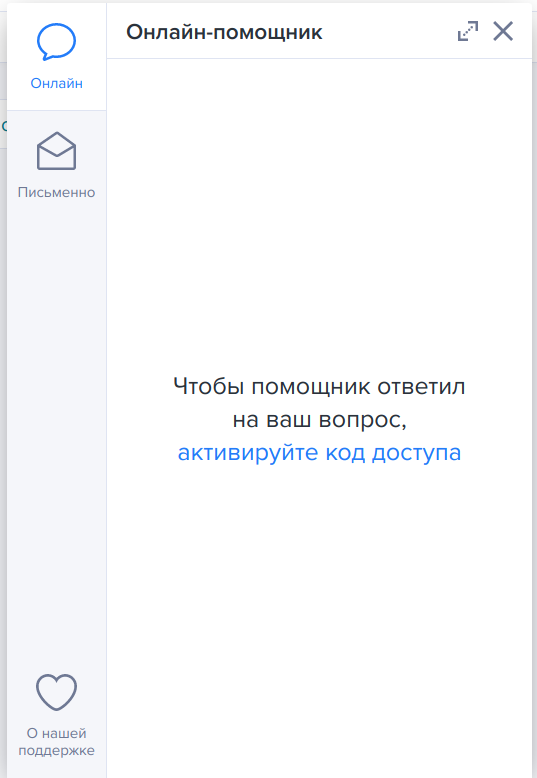

# Задание 1.8

Проанализировать справочную систему «Охрана труда»
http://vip.1otruda.ru/#/document/16/22020/bssPhr1/?of=copy-063d39f27a

Описать интерфейс и возможности работы с системой (текстовый документ или презентация или скринкаст)
(опубликовать в электронном портфолио, QR-код в отчете)

## Отчёт по заданию

### Пользовательский интерфейс и UX

Интерфейс системы не является устаревшим, но в то же время выдающимся и современным его не назовёшь.

Из **положительных сторон** пользовательского интерфейса можно отметить удобное представление элементов интерфейса в виде _карточек_ и относительную "незахламленность" страницы (редко используемые элементы не бросаются в глаза и не мешают работать).

Из **отрицательных сторон** следует заметить достаточно низкую производительность страниц системы (по результатам анализа LightHouse), а также некоторую излишнюю удалённость блоков интерфейса друг от друга (приходится много скроллить).

### Доступ к системе

Для работы в системе требуется доступ, который нужно покупать по достаточно дорогой цене.

Однако, есть возможность получить пробные три дня доступа, пройдя регистрацию и подтвердя при помощи SMS номер телефона. Кроме формальностей вроде почты/пароля, ФИО и должности, регистрация, разумеется, требует также номер телефона. Поэтому использование сервиса **НЕ может осуществляться анонимно**.

На сервисе доступна быстрая регистрация через различные сервисы. Автор настоящего обзора воспользовался регистрацией через Google Auth2. Как видно, такой метод позволяет заметно сократить количество заполняемых полей.

По прохождении регистрации система предложит получить пробный доступ или купить его по обозначенной цене. Получить пробный доступ можно, подтвердив телефон в соответствующем меню.

Там же можно активировать купленный код доступа к системе.

После подтверждения телефона система поблагодарит Вас и предоставит доступ на три дня, начиная с момента подтверждения.

Однако, некоторый функционал всё ещё будет недоступен в пробной версии. Например, онлайн-помощник (он же - онлайн консультация со специалистом) в бесплатной версии, увы, недоступна.

### Возможности и услуги системы

Рассмотрим функционал системы по её разделам.

#### Рекомендации

Ранее упомянутый раздел рекомендаций (по сути своей - лендинг сайта) представляет собой множество блоков с потенциально интересующей клиента информацией, каждую из которой можно найти по отдельности в её "родном" разделе.

#### Правовая база

Данный раздел предоставляет доступ к различным законам, приказам, положениям и документам, связанным с охраной труда.

Например, так выглядит Трудовой Кодекс в правовой базе системы.

#### Шаблоны

Раздел предоставляет любого рода шаблоны и заполненные образцы документов, так или иначе связанные с охраной труда.

#### Справочники

Раздел справочников располагает различные статистики, отчёты, обзоры и даже календарь рабочих дней.

Вот, к примеру, таблица изменений законодательства по охране труда (и т.д.) по датам.

#### Журналы

Раздел предоставляет доступ к различным тематическим журналам (в т.ч. и журналам системы). На данный момент их всего пять штук, включая журнал системы.

Читать их можно как непосредственно на сайте, так и скачав или распечатав.

#### Видео

Раздел видео посвящён тематическим видео - вебинарам, конференциям и т.п.

Как пример одного из таких - предложенный ниже вебинар Ольги Гревцевой.

#### Сервисы

Сервисы - последний раздел системы, располагающий множеством полезных инструментов, которые могут пригодиться при решении вопросов по охране труда.

Например, в нём имеется калькулятор численности нормативно рекомендуемого количества специалистов по охране труда на предприятии.

