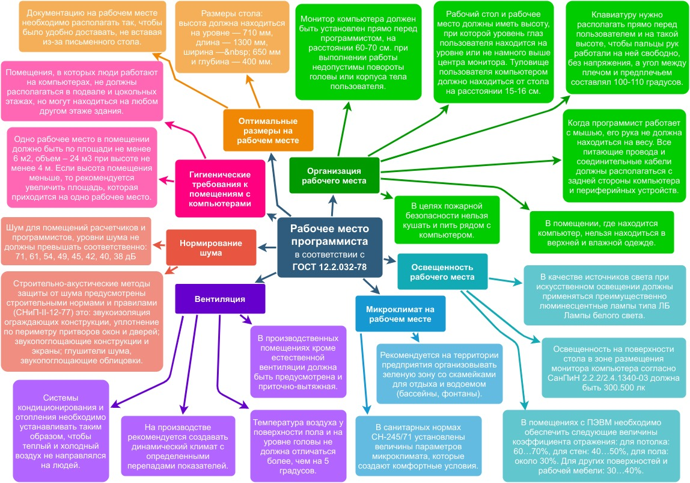

# Задание 2.1

Сделать описание рабочего места программиста

Представить в виде схемы (интеллект-карта)
(опубликовать в электронном портфолио, QR-код в отчете)

## Отчёт по заданию

Также доступен в [формате PDF](2.1.pdf) и [XML (draw.io)](2.1.xml).

